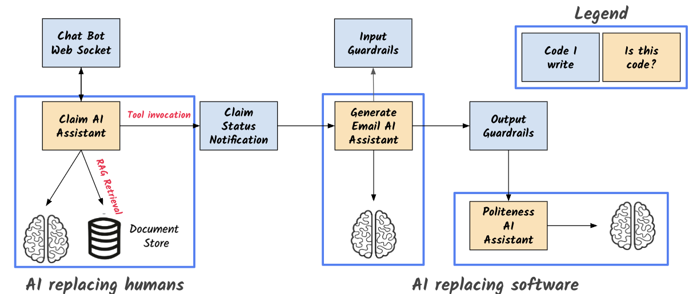

# App Architecture

# Using Ollama
If you would like to use [Ollama](https://ollama.com/) instead, first install/run Ollama on your machine. Then do one of the following:

## Building the app
When building the app, run `./mvnw clean package -DskipTests -Pollama` (or `quarkus build --clean --no-tests -Dollama`)

## Running dev mode
When running dev mode, run `./mvnw quarkus:dev -Pollama` (or `quarkus dev -Dollama`).

## Running tests
When running tests, run `./mvnw verify -Pollama` (or `quarkus build --tests -Dollama`)

## Running the app outside dev mode
If you want to run the app outside dev mode, first build the app as described above, then run `java -Dquarkus.profile=ollama,prod -jar target/quarkus-app/quarkus-run.jar`

# Using Ollama via the OpenAI endpoint
If you would like to use [Ollama](https://ollama.com/) instead but using the OpenAI endpoint, first install/run Ollama on your machine. Then do one of the following:

## Building the app
When building the app, run `./mvnw clean package -DskipTests -Pollama-openai` (or `quarkus build --clean --no-tests -Dollama-openai`)

## Running dev mode
When running dev mode, run `./mvnw quarkus:dev -Pollama-openai` (or `quarkus dev -Dollama-openai`).

## Running tests
When running tests, run `./mvnw verify -Pollama-openai` (or `quarkus build --tests -Dollama-openai`)

## Running the app outside dev mode
If you want to run the app outside dev mode, first build the app as described above, then run `java -Dquarkus.profile=ollama-openai,prod -jar target/quarkus-app/quarkus-run.jar`